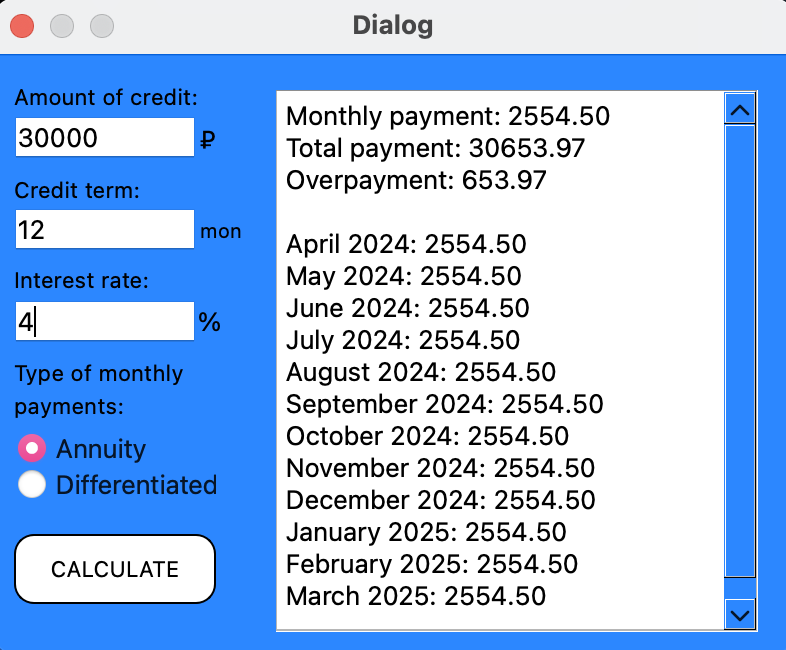

# Калькулятор с использованием модели MVC

Этот проект представляет собой простой калькулятор с использованием архитектурного шаблона MVC (Model-View-Controller). В калькуляторе реализовано две основные функции: график и кредитный калькулятор.


## Функции

- **График**: Позволяет построить график функции и визуализировать её.


  
- **Кредитный калькулятор**: Позволяет рассчитать сумму ежемесячного платежа по кредиту.

  

## Установка

1. Клонируйте репозиторий на свой компьютер:

    ```
    git clone https://github.com/ra5kolnikov/CalculatorMVC.git
    ```

2. Перейдите в каталог с проектом:

    ```
    cd CalculatorMVC
    ```

3. Соберите проект с помощью команды `make`:

    ```
    make
    ```

4. Установите проект:

    ```
    make install
    ```

## Использование

- Запустите калькулятор.
- Выберите функцию, которую хотите использовать (график или кредитный калькулятор).
- Введите необходимые данные и нажмите кнопку "Вычислить".
- Результат будет отображен на экране.

## Тестирование

1. Для запуска тестов используйте команду:

    ```
    make test
    ```

2. Для генерации отчета по покрытию кода тестами:

    ```
    make gcov_report
    ```

## Лицензия

Этот проект лицензируется в соответствии с [лицензией].

